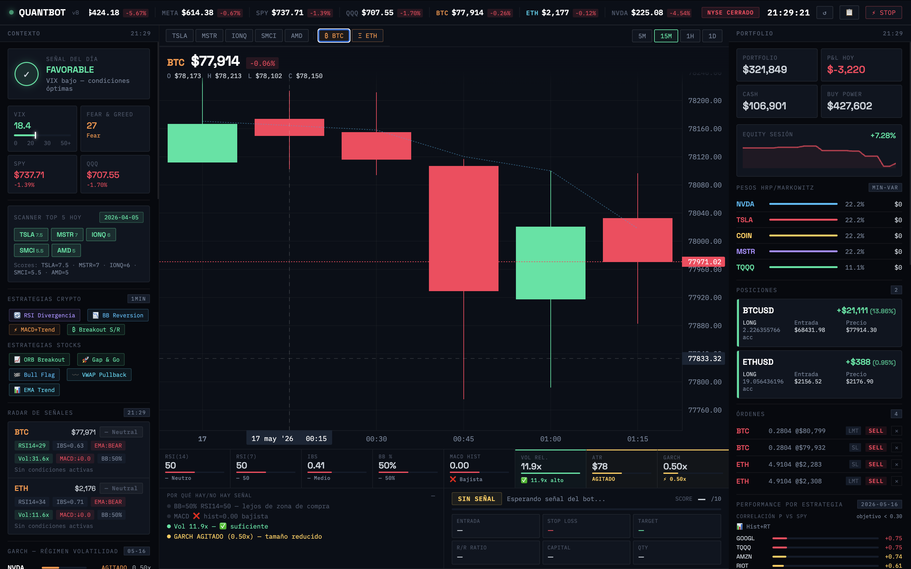
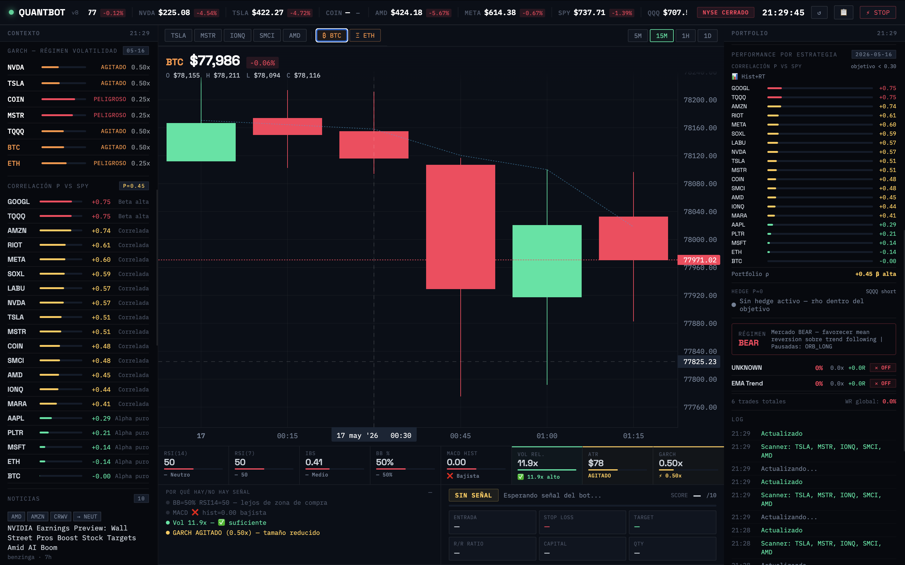
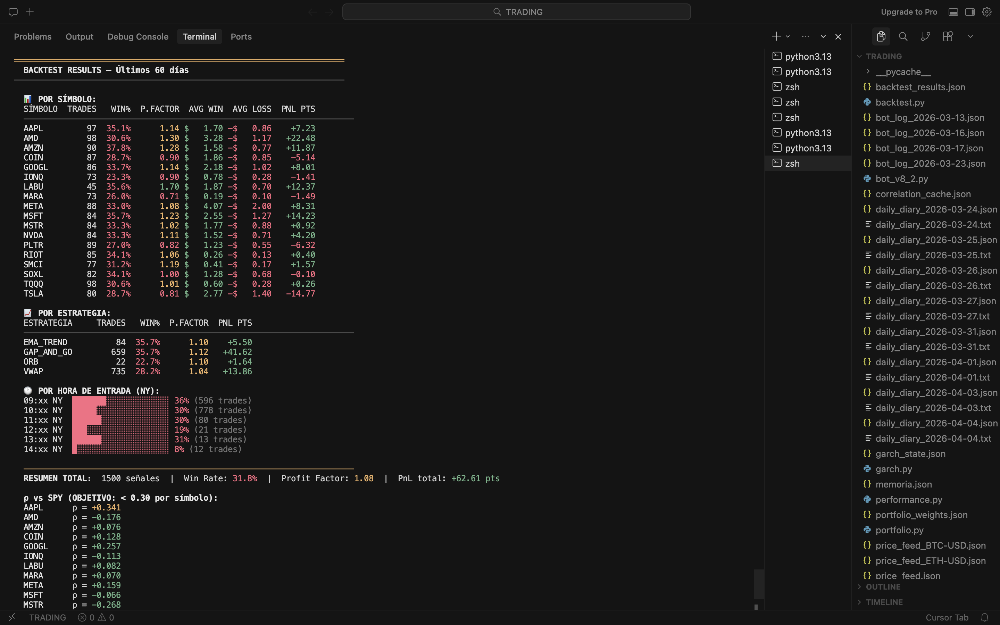

# QuantBot v8.1

> Algorithmic trading system — paper trading on Alpaca Markets  
> UAI Master of Finance · Active since March 2026

[](https://python.org)
[](https://alpaca.markets)
[](https://alpaca.markets)

---

## Overview

QuantBot is a modular algorithmic trading system built from scratch combining intraday technical strategies with institutional-grade quantitative portfolio management.

The system runs on **Alpaca paper trading** ($322,000+ current equity) and has been live since March 2026. Every component is data-driven: strategy selection is validated by a 60-day walk-forward backtest, position sizing is governed by a from-scratch GARCH(1,1) model, and portfolio construction targets **ρ ≈ 0 vs SPY** using HRP and Black-Litterman optimization.

---

## Live Dashboard



*Real-time monitor — BTC/USD 15-min chart, portfolio P&L, open positions, GARCH volatility regime, SPY correlation panel, and live signal radar.*



*Intraday correlation tracking vs SPY. Target: ρ < 0.30 per asset, portfolio ρ ≈ 0.*

---

## Architecture

```
quantbot/
├── bot_v8.py            # Trading engine — 9 strategies, signal scoring, risk management
├── universe.py          # Dynamic universe builder — screener + news + sentiment
├── portfolio.py         # Portfolio optimization — HRP, Black-Litterman, mCVaR, Ledoit-Wolf
├── garch.py             # GARCH(1,1) volatility model — MLE from scratch (scipy)
├── backtest.py          # Backtesting engine — Walk-Forward + Monte Carlo
├── performance.py       # Performance analytics — Sharpe, Alpha, VaR, attribution
├── stream_stocks.py     # Stock price feed — HTTP polling → stocks_feed.json
├── stream_crypto.py     # Crypto price feed — WebSocket tick-by-tick
├── server.py            # Local REST API + static server for the monitor
└── trading_monitor_v3.html  # Real-time dashboard
```

---

## Trading System

### Dynamic Universe Selection

Every morning, `universe.py` builds the trading universe through three stages:

1. **Market screener** — scans ~160 liquid US stocks via Alpaca snapshots, filters by price > $10 and daily dollar volume > $10M
2. **News and sentiment scoring** — Alpaca News API detects earnings, upgrades, macro catalysts; Finnhub adds bull/bear % and buzz scores; composite score ranks candidates
3. **Tier filter** — removes assets with negative 60-day backtest expectancy (PF < 0.85, N ≥ 70 trades)

Output: 25-symbol dynamic universe written to `universe_cache.json`, refreshed daily.

### Strategies

| Strategy | Asset class | Edge |
|---|---|---|
| ORB | Stocks | Opening range breakout with volume confirmation (first 60 min) |
| Gap & Go | Stocks | Gap >1.5% at open, entry on VWAP pullback |
| Bull Flag | Stocks | Impulse + tight consolidation + breakout |
| VWAP Pullback | Stocks | Mean reversion from VWAP with ATR-validated stop |
| EMA Trend | Stocks | EMA 8/21 crossover with market regime filter |
| RSI Divergence | Crypto | Bullish divergence at oversold levels (24/7) |
| BB Reversion | Crypto | Mean reversion from Bollinger Band extremes |
| MACD Trend | Crypto | MACD crossover with trend confirmation |
| Breakout S/R | Crypto | Volume-confirmed breakout above resistance |

Every signal is scored 1–10 across: momentum, volume, spread, GARCH regime, VIX level, and SPY correlation. **Minimum score to execute: 7.0.**

### Risk Management

| Parameter | Value |
|---|---|
| Max risk per trade | $2,000 |
| Max daily loss | $10,000 (hard stop) |
| Max crypto exposure | 15% of portfolio |
| Spread filter | < 15 bps |
| Trailing stop | ATR-based, persisted across restarts |
| Regime-adaptive stops | +30% in BEAR, −15% in RANGING |
| Auto-hedge | SQQQ short when portfolio ρ vs SPY > 0.45 |
| Memory block | Strategy suspended after 5 consecutive losses |

---

## Portfolio Optimization

`portfolio.py` runs each morning and writes allocation weights to `portfolio_weights.json`.

**Objective:** minimize portfolio correlation vs SPY (ρ ≈ 0), maximizing alpha uncorrelated with market moves.

| Method (`--method`) | Description |
|---|---|
| `min_rho` | Minimizes portfolio ρ vs SPY — primary method |
| `hrp` | Hierarchical Risk Parity — clustering, no matrix inversion |
| `bl` | Black-Litterman — market-implied returns + views |
| `mcvar` | Minimum CVaR — expected loss in worst 5% of scenarios |

Covariance estimated with Ledoit-Wolf shrinkage throughout.

The scanner reinforces this at the asset level using a greedy ρ-constrained selection algorithm:

```
utility(s) = score(s) − 3.0 × |ρ_portfolio_if_we_add_s|
```

**60-day backtest result: portfolio ρ vs SPY = +0.032**

---

## GARCH(1,1) Volatility Model

Implements GARCH(1,1) (Bollerslev, 1986) from scratch using Maximum Likelihood Estimation via `scipy.optimize.minimize` with L-BFGS-B. Stationarity constraint enforced (α + β < 1).

```
σ²_t = ω + α · ε²_(t-1) + β · σ²_(t-1)
```

| Annualized vol | Regime | Size multiplier |
|---|---|---|
| < 25% | Calm | 1.00× |
| 25–45% | Normal | 0.75× |
| 45–65% | Elevated | 0.50× |
| > 65% | Dangerous | 0.25× |

Final multiplier = `min(GARCH_mult, VIX_mult)` — the more conservative estimate always prevails.

---

## Backtesting

60-day Walk-Forward backtest results (March 17 – May 16, 2026):



| Metric | Value |
|---|---|
| Total signals | 1,500 |
| Win Rate | 31.8% |
| Profit Factor | 1.08 |
| Portfolio ρ vs SPY | +0.032 |
| Best symbol | LABU — PF 1.70 |
| Best strategy | GAP_AND_GO — PF 1.12, 660 trades |

Walk-Forward splits history into rolling in-sample / out-of-sample windows. Monte Carlo adds randomized slippage (0–15 bps) and partial fill rates (85–100%) across 5,000 simulations.

Full results: [docs/backtest_results.md](docs/backtest_results.md)

---

## Performance Analytics

```bash
python performance.py              # full report — live trade logs
python performance.py --days 30    # last 30 days
python performance.py --export     # write performance_report.json
```

Metrics computed: Sharpe, Sortino, Calmar, Alpha/Beta vs SPY, Information Ratio, VaR 95%, CVaR, Profit Factor, Expectancy, Max Drawdown, attribution by symbol / strategy / VIX regime.

---

## Dashboard

```bash
python server.py   # serves http://localhost:8080
```

Real-time monitor with portfolio P&L, open positions, live VIX (CBOE), Fear & Greed Index, BTC/ETH candlestick charts, signal radar, GARCH regime per symbol, and SPY correlation panel.

---

## Startup Sequence

```bash
python stream_crypto.py            # Terminal 1 — runs 24/7
python stream_stocks.py            # Terminal 2 — runs 24/7

# Before 9:00 AM NY, run once per session:
python garch.py                    # volatility multipliers
python portfolio.py --method min_rho   # portfolio weights + correlation cache
python universe.py                 # dynamic universe (screener + news scoring)

python server.py                   # Terminal 3
python bot_v8.py                   # Terminal 4
```

---

## Setup

```bash
pip install -r requirements.txt --break-system-packages
cp .env.example .env   # add Alpaca API credentials
```

Requires an [Alpaca](https://alpaca.markets) paper trading account. Tested on Python 3.10+, macOS.

> Source code is private. This repository documents the system architecture, methodology, and results.

---

## References

- Markowitz, H. (1952). Portfolio Selection. *Journal of Finance*.
- Bollerslev, T. (1986). Generalized autoregressive conditional heteroskedasticity. *Journal of Econometrics*.
- Ledoit, O. & Wolf, M. (2004). A well-conditioned estimator for large-dimensional covariance matrices. *Journal of Multivariate Analysis*.
- López de Prado, M. (2016). Building Diversified Portfolios that Outperform Out-of-Sample. *Journal of Portfolio Management*.

---

*Paper trading only. Not financial advice.*
